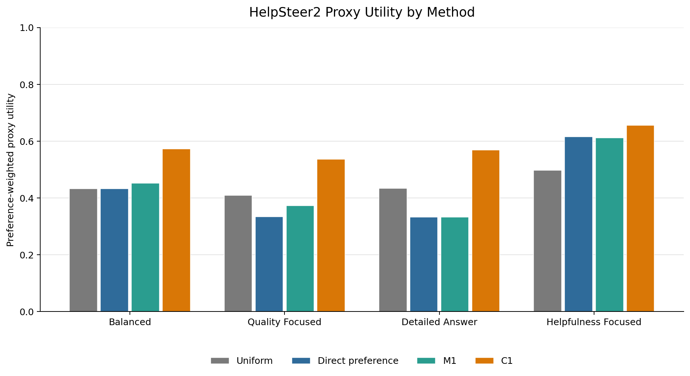
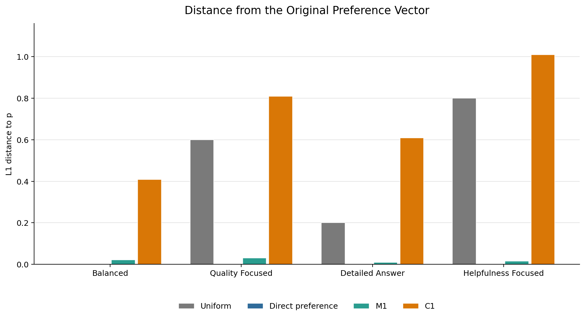
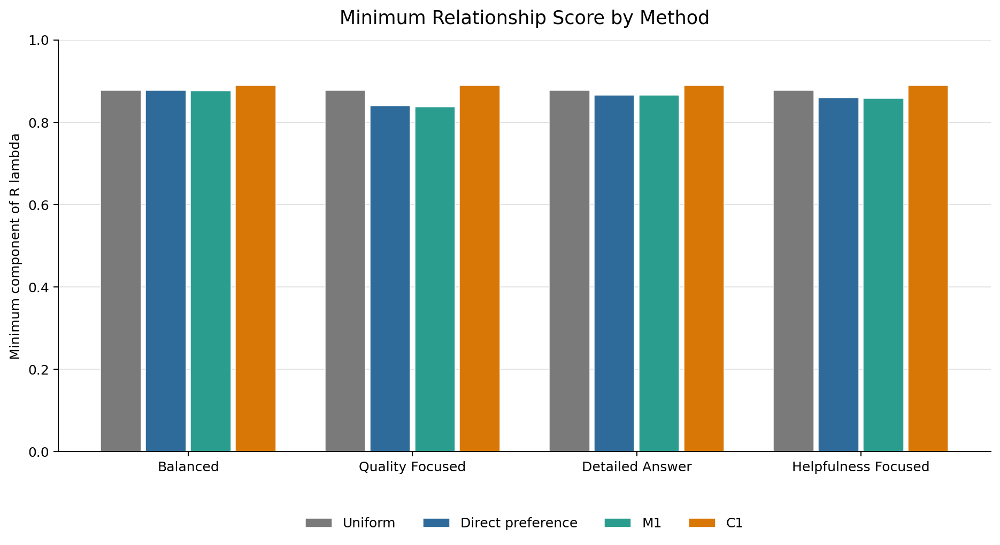

# HelpSteer2 Prototype Results

## Prototype Status

This experiment is a lightweight GPT-2 + LoRA prototype for
preference-aware coefficient correction in Rewarded-Soups-style model
merging. It uses five HelpSteer2 attributes:

- helpfulness
- correctness
- coherence
- complexity
- verbosity

The prototype implements the pipeline

$$
\delta_i \rightarrow R \rightarrow \lambda=f(p,R)
\rightarrow \theta(\lambda)
$$

for a small multi-objective setting. Its purpose is to test the infrastructure,
coefficient mappings, and evaluation workflow before moving to stronger models
and evaluators.

## Pipeline Summary

The implemented HelpSteer2 workflow is:

1. Train one objective-specific LoRA adapter per attribute from the same GPT-2
   base model.
2. Merge the adapters using fixed coefficient vectors.
3. Generate responses and compute lightweight heuristic proxy scores.
4. Compute a relationship matrix $R$ from cosine similarities between
   flattened LoRA adapter parameters.
5. Compute direct-preference and the current M1, M2, C1, C2, P1, and P2
   coefficient vectors.
6. Merge the adapters using those coefficients and compare their generated
   responses.
7. Select the best tested hyperparameter for each method and preference
   according to `utility_for_preference`.

## Result Artifacts

The main result files are:

| File | Contents |
| --- | --- |
| `results/helpsteer2_adapter_merge_generations.csv` | Responses generated for the initial fixed coefficient candidates. |
| `results/helpsteer2_adapter_merge_scored_generations.csv` | Fixed-candidate responses with heuristic attribute proxy scores. |
| `results/helpsteer2_lambda_sweep_summary.csv` | Aggregate proxy scores and preference-weighted utilities for the finite sweep. |
| `results/helpsteer2_relationship_matrix.csv` | The $5 \times 5$ cosine-similarity matrix for the five LoRA adapters. |
| `results/helpsteer2_relationship_matrix_metadata.json` | Adapter paths, vector representation, and relationship-matrix metadata. |
| `results/helpsteer2_m1_c1_coefficients.csv` | Direct-preference, M1, and C1 coefficients for four preference vectors. |
| `results/helpsteer2_all_method_coefficients.csv` | Current M1, M2, C1, C2, P1, and P2 coefficients for the active preference vectors. |
| `results/helpsteer2_all_method_coefficients_metadata.json` | Method definitions, hyperparameters, objective order, and simplex-validation metadata for the all-method coefficient table. |
| `results/helpsteer2_m1_c1_merge_generations.csv` | Responses generated from uniform, direct-preference, M1, and C1 merges. |
| `results/helpsteer2_m1_c1_scored_generations.csv` | Generated responses with the five heuristic attribute proxies. |
| `results/helpsteer2_m1_c1_comparison.csv` | Aggregate method utilities, coefficient distances, and finite-sweep comparisons. |
| `results/helpsteer2_method_summary_table.csv` | Best tested hyperparameter for each method and preference. |
| `results/helpsteer2_best_methods_by_preference.csv` | Highest-utility method for each tested preference. |
| `results/helpsteer2_m1_c1_result_summary.md` | Concise companion summary of the M1/C1 comparison. |
| `results/helpsteer2_definition_metrics.csv` | Definition-style metrics: objective rewards, average reward, utility, utility improvement, finite-sweep gap, preference distances, $R$-distance, and normalized Tchebychev scores. |
| `results/helpsteer2_definition_metrics_summary.md` | Short summary of the definition-style metrics. |

## Relationship Matrix

The measured relationship matrix is:

| Adapter | Helpfulness | Correctness | Coherence | Complexity | Verbosity |
| --- | ---: | ---: | ---: | ---: | ---: |
| Helpfulness | 1.0000 | 0.9306 | 0.9015 | 0.8568 | 0.8396 |
| Correctness | 0.9306 | 1.0000 | 0.9372 | 0.8467 | 0.8275 |
| Coherence | 0.9015 | 0.9372 | 1.0000 | 0.8132 | 0.8136 |
| Complexity | 0.8568 | 0.8467 | 0.8132 | 1.0000 | 0.9080 |
| Verbosity | 0.8396 | 0.8275 | 0.8136 | 0.9080 | 1.0000 |

All off-diagonal similarities are positive and relatively high. They range
from 0.8132 to 0.9372, with a mean of approximately 0.8675. The strongest
pair is correctness/coherence, followed by helpfulness/correctness.
Complexity/verbosity is also strongly aligned.

These values indicate similarity between flattened LoRA parameter vectors.
They do not establish behavioral equivalence between objectives. In this
prototype, adapter geometry is a proxy for specialist relationships and
requires further empirical validation.

## Coefficient Mappings

### Direct Preference

The direct baseline preserves the user preference vector:

$$
\lambda=p.
$$

### M1: MGDA-Inspired One-Shot Mapping

M1 computes

$$
\lambda_{\mathrm{M1}}
:=
\argmin_{\lambda\in\Delta_m}
\lambda^\top R\lambda+\rho\|\lambda-p\|_2^2.
$$

The parameter $\rho$ controls how strongly the mapping stays near the original
preference vector $p$.

### C1: CAGrad-Inspired One-Shot Mapping

C1 computes a trust-region CAGrad-inspired coefficient vector:

$$
\lambda_{\mathrm{C1}}
:=
\argmax_{\lambda\in\Delta_m}\min_i(R\lambda)_i
$$

subject to

$$
(\lambda-p)^\top R(\lambda-p)\le c^2\max(p^\top Rp,\varepsilon).
$$

The parameter $c$ controls the trust-region size around $p$.

## M1/C1 Proxy Comparison

The files `results/helpsteer2_m1_c1_*` were generated during an earlier
narrow M1/C1 comparison. They should be regenerated before being cited as
current thesis evidence, because the active M1 definition is now the
MGDA-inspired mapping above rather than the earlier relationship-softmax
prototype. The all-method coefficient table is the current source for the
thesis definitions.

For the earlier recorded proxy run, each preference and method used the
hyperparameter setting with the highest `utility_for_preference`. Under that
selection rule, C1 with $\rho=0.1$ had the highest proxy utility among
uniform, direct-preference, the earlier M1 prototype, and C1 for all four
tested preference vectors.

| Preference | Best method | Proxy utility | Direct utility | Improvement over direct |
| --- | --- | ---: | ---: | ---: |
| Balanced | C1, $\rho=0.1$ | 0.572662 | 0.432794 | +0.139868 |
| Quality focused | C1, $\rho=0.1$ | 0.536672 | 0.333197 | +0.203474 |
| Detailed answer | C1, $\rho=0.1$ | 0.569239 | 0.332967 | +0.236272 |
| Helpfulness focused | C1, $\rho=0.1$ | 0.655081 | 0.614761 | +0.040320 |

Thus, in this recorded prototype run, the selected C1 setting improves over
direct preference for every tested preference vector according to the
heuristic utility. This is an empirical observation about this small proxy
evaluation, not evidence that C1 is generally superior.

The best tested earlier M1-prototype setting had a more mixed relationship to
direct preference:

- balanced: +0.018528 at $\tau=2$;
- quality focused: +0.039566 at $\tau=2$;
- detailed answer: no measured change at $\tau=0.5$;
- helpfulness focused: -0.003049 at $\tau=0.5$.

That earlier M1 prototype improved on direct preference in two of the four
cases, tied in one case, and was slightly lower in one case under those proxy
scores.

## Proxy Utility and Preference Faithfulness

The coefficient distances from that earlier run reveal an important trade-off.
The selected earlier M1-prototype
settings remain close to the original preference vectors:

- L1 distance: 0.0093 to 0.0308;
- L2 distance: 0.0046 to 0.0150.

The selected C1 settings at $\rho=0.1$ move substantially farther:

- L1 distance: 0.4089 to 1.0089;
- L2 distance: 0.2013 to 0.5516.

Consequently, the current result should be described as a trade-off between
proxy utility and preference faithfulness. C1 attains higher heuristic utility
in this run, but does so with larger deviations from the user-specified
preference vector. The earlier M1 prototype made more conservative corrections
and more closely preserved $p$.

C1 with $\rho=0.1$ also has the highest minimum relationship score among the
selected method settings for each preference. This is consistent with its
optimization objective, but does not independently validate generated-response
quality.

## Fixed Lambda Sweep

The finite fixed sweep evaluates nine coefficient candidates. Its best tested
candidate, denoted $\lambda_{\mathrm{best}}$, is:

| Preference | $\lambda_{\mathrm{best}}$ | Candidate | Utility |
| --- | --- | --- | ---: |
| Balanced | [0, 1, 0, 0, 0] | One-hot correctness | 0.677240 |
| Quality focused | [0, 1, 0, 0, 0] | One-hot correctness | 0.708893 |
| Detailed answer | [0, 1, 0, 0, 0] | One-hot correctness | 0.685013 |
| Helpfulness focused | [1, 0, 0, 0, 0] | One-hot helpfulness | 0.777881 |

The selected C1 result remains below $\lambda_{\mathrm{best}}$ for every
preference in this finite sweep. The gaps are -0.104578, -0.172221,
-0.115774, and -0.122800 for balanced, quality-focused, detailed-answer, and
helpfulness-focused preferences, respectively.

Here, $\lambda_{\mathrm{best}}$ means only the best of the nine tested fixed
candidates, not a global optimum. The dominance of one-hot candidates may
reflect the adapters, heuristic scoring rules, small prompt sample, or
generation variability.

## Interpretation

The current evidence supports three limited observations:

1. The C1 setting with $\rho=0.1$ has the highest heuristic utility among
   the four compared methods for all tested preferences.
2. The earlier M1 prototype changed the original preference vector much less
   than C1 in that recorded run.
3. Higher proxy utility and greater preference faithfulness are not aligned in
   this run: the strongest C1 proxy results require larger movement away from
   $p$.

These observations motivate evaluating coefficient mappings along both axes:
response-level utility and distance from the stated preference. They do not
show that C1 is generally better, and they do not establish improvement of the
global Pareto front.

## Definition-Style Evaluation Metrics

The current HelpSteer2 comparison has also been reformatted using the thesis
evaluation metrics from Definition 3.17. In this prototype, the five
HelpSteer2 proxy scores are treated as normalized rewards $\tilde r_i$.

The derived table reports:

- individual objective rewards $\tilde r_i(\theta(\lambda))$;
- average reward across the five objectives;
- preference-weighted utility $U_p$;
- utility improvement over direct preference interpolation;
- finite-sweep gap to $\lambda_{\mathrm{best}}$;
- L1 and L2 preference-faithfulness distances;
- optional $R$-geometric distance $(\lambda-p)^TR(\lambda-p)$;
- normalized Tchebychev-style shortfall scores.

The corresponding files are
`results/helpsteer2_definition_metrics.csv` and
`results/helpsteer2_definition_metrics_summary.md`. These metrics reuse the
same heuristic proxy rewards, so the limitations below still apply.

## Limitations

- The scores are lightweight heuristic proxy scores.
- They are not HelpSteer2 human labels.
- They are not reward-model scores.
- Generated responses do not automatically have HelpSteer2 labels.
- The comparison uses only four prompts per coefficient setting.
- The current results represent a single recorded run without multiple random
  seeds.
- Hyperparameters are selected using the same proxy evaluation reported in the
  comparison.
- GPT-2 is a small prototype model with limited instruction-following ability.
- The adapters use supervised prototype training rather than a final alignment
  method.
- Flattened LoRA adapter geometry is only a proxy for full task-vector
  geometry.
- The finite sweep covers only nine coefficient vectors.
- The results do not establish global Pareto-front improvement.

## Next Steps

1. Replace or supplement heuristic proxies with stronger reward models or
   external evaluators.
2. Increase the number and diversity of evaluation prompts.
3. Repeat training and generation with multiple random seeds.
4. Separate hyperparameter selection from final evaluation.
5. Compare methods against a more systematic finite
   $\lambda_{\mathrm{best}}$ sweep.
6. Test whether the utility/preference-faithfulness trade-off persists with
   TinyLlama or another stronger small model.
7. Optionally evaluate additional mappings such as M2, P1, P2, C2, or IC1.

For a shorter table-oriented account of the comparison, see
[`results/helpsteer2_m1_c1_result_summary.md`](helpsteer2_m1_c1_result_summary.md).
